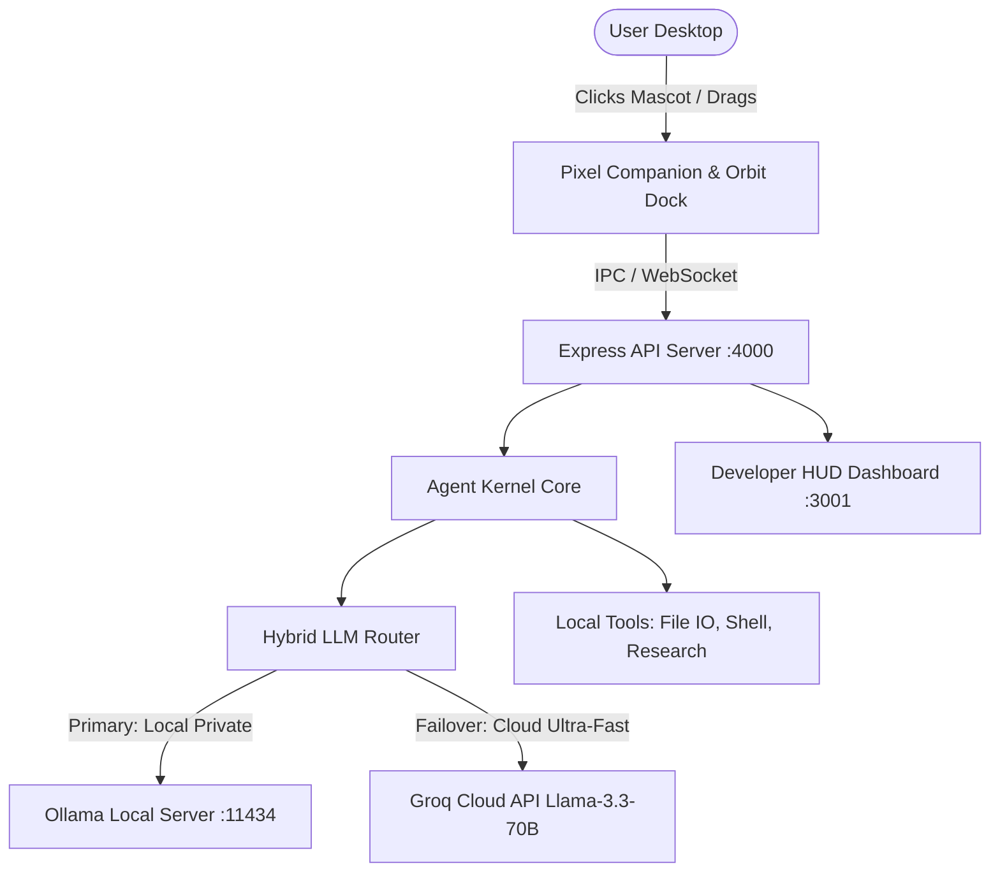

# PAA — Personal Autonomous Agent & Floating Desktop Companion

<div align="center">

-0078d4?style=for-the-badge&logo=windows&logoColor=white)


**An open-source, local-first autonomous digital employee and desktop companion that wanders your Windows taskbar, executes real-world research & coding tasks, and features instant Groq cloud failover.**

[⬇️ Download Installer (.exe)](https://github.com/ATANU0023/PAA/releases/download/v0.1.0/PAA.Companion.Setup.0.1.0.exe) • [🚀 Download Portable (.exe)](https://github.com/ATANU0023/PAA/releases/download/v0.1.0/PAA.Companion.0.1.0.exe) • [📦 GitHub Releases](https://github.com/ATANU0023/PAA/releases/tag/v0.1.0) • [🌐 Live Showcase](https://github.com/ATANU0023/PAA)

</div>

---

## 🌟 Key Highlights

- **👾 Retro Pixel Art Mascot**: 16-bit cybernetic cat companion anchored flush to the Windows taskbar with 9 reactive states (`idle`, `thinking`, `searching`, `reading`, `coding`, `executing`, `waiting`, `success`, `error`).
- **🪐 Radial Orbit Action Dock**: Click the companion to fan out a circular orbital menu (Autonomous Mode, Inspect HUD, Quick Prompt, Failover Settings, Minimize).
- **⚡ Hybrid LLM Failover**: Runs 100% private local models with Ollama (`qwen2.5-coder:7b`) and automatically fails over to Groq Cloud (`llama-3.3-70b-versatile`) in <1.2 seconds if local models are unavailable or overloaded.
- **🪟 True Desktop Transparency**: Frameless Electron window with hardware click-passthrough and drag support.
- **📊 Full Developer HUD**: Optional dual-column control center with step-by-step execution trees, token latency graphs, and real-time agent telemetry stream.

---

## 📥 Downloads (Windows 10 / 11 64-bit)

| Package | Type | Description | Link |
| :--- | :--- | :--- | :--- |
| **PAA Companion Installer** | `.exe` (~173 MB) | Standard Windows Setup. Includes Desktop shortcut, Start Menu entry, and uninstaller. | [Download Setup (.exe)](https://github.com/ATANU0023/PAA/releases/download/v0.1.0/PAA.Companion.Setup.0.1.0.exe) |
| **PAA Companion Portable** | `.exe` (~173 MB) | Standalone single-file executable. Runs directly off USB / external SSD without install. | [Download Portable (.exe)](https://github.com/ATANU0023/PAA/releases/download/v0.1.0/PAA.Companion.0.1.0.exe) |
| **All Releases & Checksums** | Source / Tag | View release changelog, blockmaps, and SHA-256 integrity checksums. | [GitHub Releases v0.1.0](https://github.com/ATANU0023/PAA/releases/tag/v0.1.0) |

---

## 🏗️ Architecture



---

## ⚡ Quick Start for Developers

### Prerequisites
- Node.js 20+
- (Optional) [Ollama](https://ollama.com) for 100% offline private local inference
- (Optional) [Groq Cloud API Key](https://console.groq.com) for cloud failover

### 1. Clone & Install
```bash
git clone https://github.com/ATANU0023/PAA.git
cd PAA
npm install
```

### 2. Configure Environment
Copy `.env.example` (or edit `.env` in the root):
```env
PORT=4000
GROQ_API_KEY=your_groq_api_key_here
OLLAMA_BASE_URL=http://localhost:11434
```

### 3. Run in Development Mode
Open 3 terminals:

```bash
# Terminal 1: Backend API & Agent Kernel
npm run dev:api

# Terminal 2: UI Dev Server
npm run dev:ui

# Terminal 3: Launch Floating Desktop Mascot
npm run dev:desktop
```

---

## 📦 Building Production Binaries

To compile Next.js into a static export and package the Windows Installer and Portable `.exe` using `electron-builder`:

```bash
npm run dist
```

Outputs are generated inside `apps/desktop-ui/dist/`:
- `PAA Companion Setup 0.1.0.exe` (Installer)
- `PAA Companion 0.1.0.exe` (Portable)

---

## 🌐 Deploying the Landing Page to Vercel

The project includes a high-performance, responsive showcase landing page with an interactive taskbar pet simulator inside `apps/landing-page`.

### Option A: In Vercel Web Dashboard
1. Import repository `ATANU0023/PAA`.
2. Set **Root Directory** to `apps/landing-page`.
3. Set **Framework Preset** to **Other**.
4. Click **Deploy**.

### Option B: Preview Locally
```bash
npm run preview:landing
```
Visit `http://localhost:3002` to test the landing page and simulator locally.

---

## 💾 Running Local Models from an External SSD / Pendrive

To keep your primary C: drive free, store your 7B+ GGUF weights on an external drive:

```powershell
# Set model storage to external drive (e.g. E:\ollama\models)
[System.Environment]::SetEnvironmentVariable('OLLAMA_MODELS', 'E:\ollama\models', 'User')

# Start Ollama
ollama serve

# Pull coder model to external drive
ollama pull qwen2.5-coder:7b
```

---

## 📄 License

MIT © [Atanu](https://github.com/ATANU0023)
